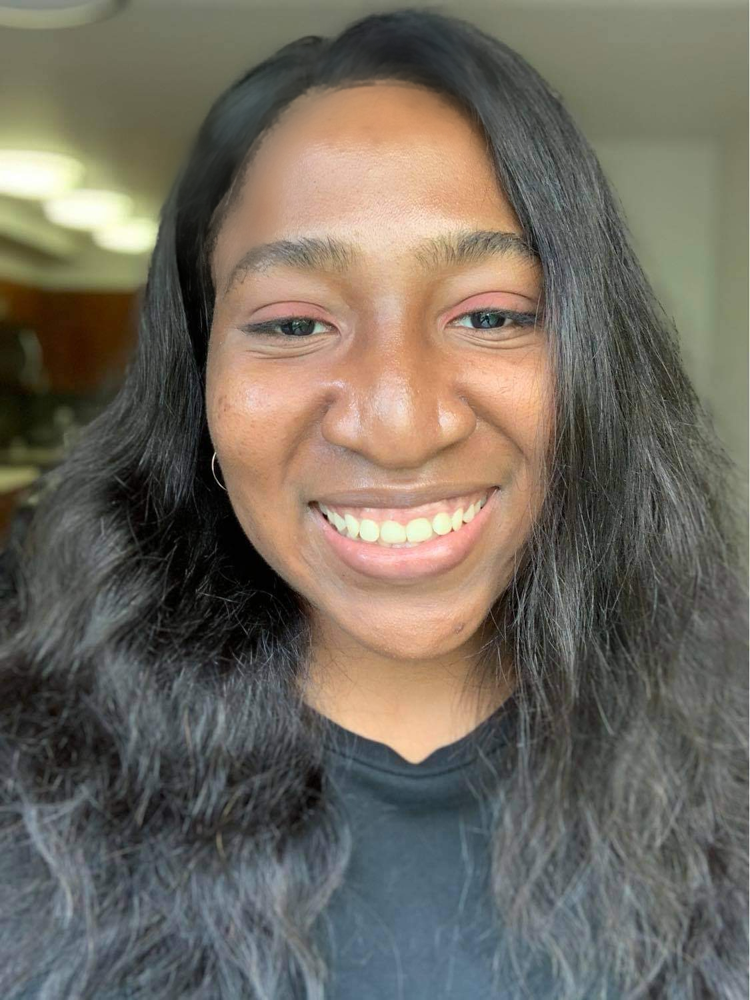

 

## About

I am currently a mid-level software engineer working on Machine Learning Infra.

I am originally from Nigeria 🇳🇬.

I have about 3 years of experience as a Software Engineer.  I've worked on <a href="https://atscaleconference.com/videos/ai-scale-2020-f3-next-generation-feature-framework-at-facebook/"> Facebook's Feature Framework (F3)</a>, working on improving ML engineers' ability to innovate, build features and experiment faster.  
  
I've worked on building ranking and retrieval models to help people discover communities, content and events as an ML Generalist on Facebook Search.
 
In another life, I built Android applications as part of internships.

I am broadly interested in building great ML Infrastructure and accelerating development times of the next big AI wins.

 

 

## Education

I hold a B.Sc. degree in Computer Science from Howard University.

My undergraduate reasearch work explored social media and the spread of health (mis)information, and was advised by Dr. Jiang Li.

 

## Technical Competencies

- Programming Languages: Python, C++, C, Shell Script, SQL
- Statistical & Optimization Languages:  MATLAB
- Cloud Platform & Big Data: Apache Open Source Software (Spark, Hadoop, Hive, Thrift etc.), Presto
- Machine Learning: Statistical Learning, TensorFlow, fblearner(https://engineering.fb.com/2016/05/09/core-data/introducing-fblearner-flow-facebook-s-ai-backbone/), scikit-learn.
- Other: Tupperware/Twine - similar to Kubernetes- (https://engineering.fb.com/2019/06/06/data-center-engineering/twine/)

 

 

## Hobbies & Other Interests

I also generally find advances in Natural Language Processing(specifically Commonsense reasoning, Natural Language generation and Narrative understanding)  interesting. I spend some time reading papers, updates in these areas because I think it's really exciting.

Interested in ML Systems in general.

Outside of software engineering, I enjoy watching netflix shows, reading, writing short stories and essays.

   
